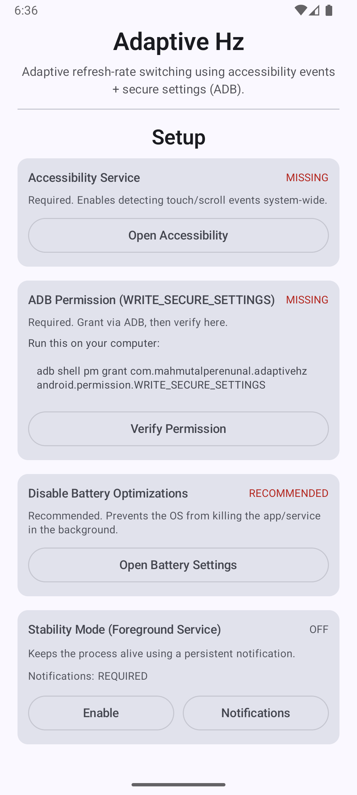
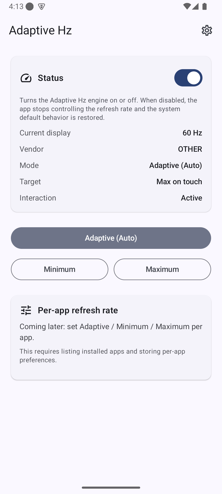
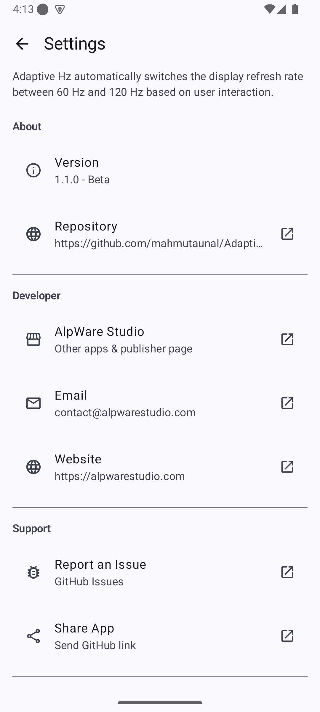

<p align="center">
  
</p>

<p align="center">
  
  
  
  
</p>

# Adaptive Hz

Automatic, interaction-based refresh rate switching for Android devices.

Adaptive Hz dynamically switches your device between its supported minimum and maximum refresh rates based on real user interaction.

Originally created for Samsung mid-range devices lacking true adaptive mode, the project now supports Xiaomi / HyperOS devices as well.

---

## Overview

---

## Screenshots

<p align="center">
  
  
  
</p>

- Setup & Permissions screen
- Dashboard (Light mode)
- Dashboard (Dark mode)

Many Android devices offer multiple refresh rates (60Hz / 90Hz / 120Hz) but:

- Do not provide true adaptive switching
- Restrict adaptive behavior to specific apps
- Or aggressively kill background services

Adaptive Hz solves this by:

- Switching to Maximum Hz when you touch or scroll
- Dropping to Minimum Hz when idle
- Operating fully automatically
- Requiring no root access
- Running completely offline (no ads, no tracking)

---

## Key Features

- Interaction-based refresh switching
- Hybrid detection model (fast + stable)
- Vendor-aware refresh control
- Optional Stability Mode (foreground service)
- Boot persistence
- English & Turkish localization
- Minimal, Material You UI

---

## Supported Vendors

### Samsung
Uses:

```
refresh_rate_mode
```

### Xiaomi / HyperOS
Uses:

```
miui_refresh_rate
```

Vendor detection is automatic.

---

## Detection Strategy

To balance responsiveness and stability:

- Immediate boost on first touch
- Grace window for scroll/focus events
- Idle timeout fallback (default ≈3.5 seconds)
- Lock screen and Always-On Display ignored

This prevents infinite refresh loops and unnecessary maximum-Hz usage.

---

## Permissions

| Permission | Required | Purpose |
|------------|----------|---------|
| WRITE_SECURE_SETTINGS | Yes | Modify refresh rate system setting |
| Accessibility Service | Yes | Detect global interaction |
| Foreground Service | Optional | Stability Mode |
| Disable Battery Optimization | Recommended | Prevent background kill |

Grant secure permission via ADB:

```bash
adb shell pm grant com.mahmutalperenunal.adaptivehz android.permission.WRITE_SECURE_SETTINGS
```

---

## Installation

1. Install APK

```bash
adb install AdaptiveHz.apk
```

2. Grant secure permission (see above)

3. Enable Accessibility Service:

Settings → Accessibility → Installed Services → Adaptive Hz → Enable

4. (Recommended) Enable Stability Mode inside the app

---

## How It Works

| State | Refresh Rate |
|-------|---------------|
| Active touch | Maximum |
| Idle | Minimum |
| Locked / AOD | Minimum |
| Manual mode | Forced selection |

The system is event-driven and does not run continuous background loops.

---

## Architecture

```
Adaptive Hz
│
├── MainActivity
├── AdaptiveHzService
├── RefreshRateController
├── StabilityForegroundService
└── BootReceiver
```

---

## Performance

- Very low CPU usage
- No polling loops
- Battery savings typically 5–15% per day (usage dependent)

---

## Known Limitations

- Depends on OEM allowing secure setting writes
- Some ROMs may override refresh policies
- User force-stop disables background switching until reopened
- Accessibility service must remain enabled

---

## Tested Devices

- Samsung Galaxy A52 (Android 14 / OneUI 6)
- Redmi Note 14 Pro 5G (HyperOS 3.x – community tested)

More devices welcome.

---

## Contributing

Feedback, device reports, and improvements are welcome.

Please include:

- Device model
- Android version
- ROM
- Supported refresh rates

---

## License

MIT License

---

Made with care by AlpWare Studio

---