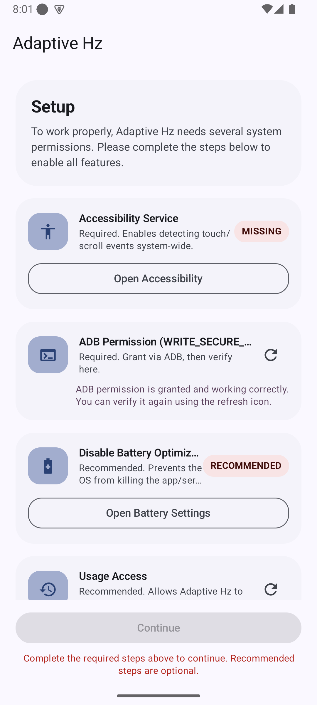
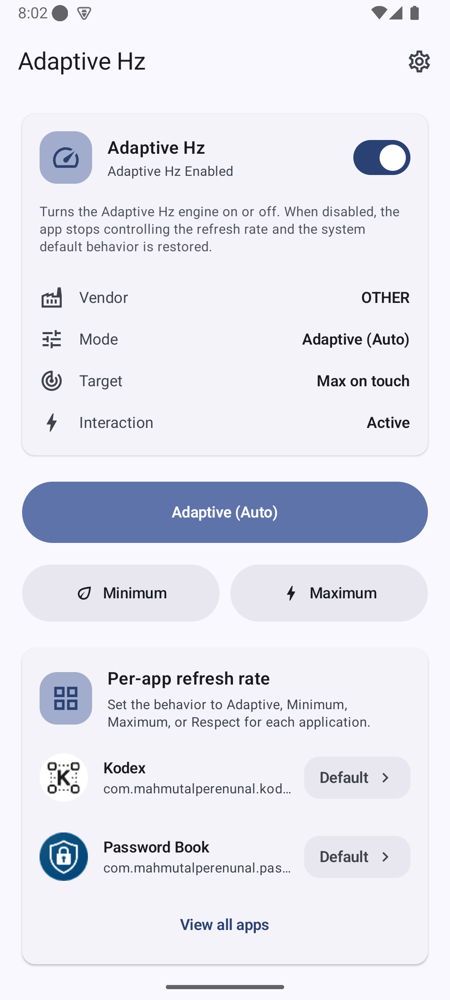
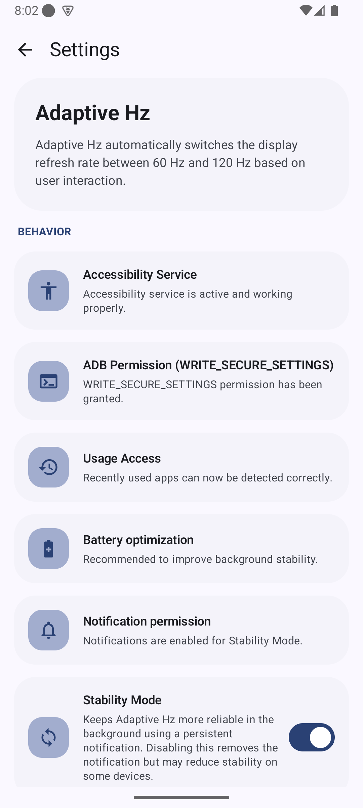
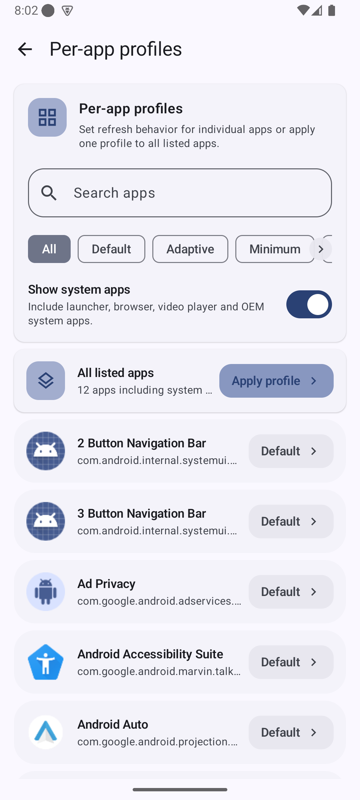

<p align="center">
  
</p>

<p align="center">
  
  
  
  
</p>

# Adaptive Hz

> Bring true adaptive refresh rate to devices that don’t support it — intelligently, automatically, and without root.

<p align="center">
  <a href="https://github.com/mahmutaunal/Adaptive-Hz/releases">
    
  </a>
  <a href="#installation">
    
  </a>
</p>

---

⭐ If this project helps you, consider giving it a star!

---

## 🚀 What is Adaptive Hz?

> ⚡ Automatically switches between minimum and maximum refresh rates based on real user interaction  
> 🔋 Saves battery without sacrificing smoothness  
> 🔒 100% offline, no tracking, no ads  

Adaptive Hz dynamically switches your device between its supported minimum and maximum refresh rates based on real user interaction.

Unlike OEM implementations, it works globally across apps and focuses on real touch behavior.

---

## Overview

### Why this exists

Many mid-range Android devices (especially Samsung & Xiaomi) either:
- Do not provide true adaptive refresh rate
- Or limit it to specific apps

This results in unnecessary battery drain or poor responsiveness.

Adaptive Hz was built to fix this gap with a simple, system-wide solution.

---

## Screenshots

<p align="center">
  
  
  
  
</p>

- Setup & Permissions
- Dashboard (Light mode)
- Settings
- Dashboard (Dark mode)

Many Android devices offer multiple refresh rates (60Hz / 90Hz / 120Hz) but:

- Do not provide true adaptive switching
- Restrict adaptive behavior to specific apps
- Or aggressively kill background services

Adaptive Hz solves this by:

- Switching to Maximum Hz when you touch or scroll
- Dropping to Minimum Hz when idle
- Operating fully automatically
- Requiring no root access
- Running completely offline (no ads, no tracking)

---

## Key Features

- Interaction-based refresh switching
- Hybrid detection model (fast + stable)
- Vendor-aware refresh control
- Optional Stability Mode (foreground service)
- Boot persistence
- English & Turkish localization
- Minimal, Material You UI

---

## Supported Vendors

### Samsung
Uses:

```
refresh_rate_mode
```

### Xiaomi / HyperOS
Uses:

```
miui_refresh_rate
```

Vendor detection is automatic.

---

## Detection Strategy

To balance responsiveness and stability:

- Immediate boost on first touch
- Grace window for scroll/focus events
- Idle timeout fallback (default ≈3.5 seconds)
- Lock screen and Always-On Display ignored

This prevents infinite refresh loops and unnecessary maximum-Hz usage.

---

## Permissions

| Permission | Required | Purpose |
|------------|----------|---------|
| WRITE_SECURE_SETTINGS | Yes | Modify refresh rate system setting |
| Accessibility Service | Yes | Detect global interaction |
| Foreground Service | Optional | Stability Mode |
| Disable Battery Optimization | Recommended | Prevent background kill |

Grant secure permission via ADB:

```bash
adb shell pm grant com.mahmutalperenunal.adaptivehz android.permission.WRITE_SECURE_SETTINGS
```

---

## Installation

1. Install APK

```bash
adb install AdaptiveHz.apk
```

2. Grant secure permission (see above)

3. Enable Accessibility Service:

Settings → Accessibility → Installed Services → Adaptive Hz → Enable

4. (Recommended) Enable Stability Mode inside the app

---

## How It Works

| State | Refresh Rate |
|-------|---------------|
| Active touch | Maximum |
| Idle | Minimum |
| Locked / AOD | Minimum |
| Manual mode | Forced selection |

The system is event-driven and does not run continuous background loops.

---

## Architecture

```
Adaptive Hz
├── core
│   ├── engine
│   │   ├── strategy
│   │   │   ├── VendorStrategy
│   │   │   ├── SamsungStrategy
│   │   │   ├── XiaomiStrategy
│   │   │   └── OtherStrategy
│   │   ├── AdaptiveHzEngine
│   │   └── EngineModels.kt
│   └── system
│       ├── DeviceVendor.kt
│       └── RefreshRateController
    ├── BootReceiver
    ├── AdaptiveHzService
    ├── StabilityForegroundService
├── ui
│   ├── home
│   │   ├── components
│   │   │   ├── DashboardContent.kt
│   │   │   └── SetupContent.kt
│   │   └── HomeScreen.kt
│   ├── settings
│   │   └── SettingsScreen.kt
│   └── theme
│
└── MainActivity.kt
```

---

## Performance

- Very low CPU usage
- No polling loops
- Battery savings typically 5–15% per day (usage dependent)

---

## 🔬 Technical Highlights

- Event-driven architecture (no polling)
- Minimal CPU overhead
- OEM-aware system setting control
- Accessibility-based interaction detection

---

## 📊 Benchmark & Testing

Typical battery savings: **~5–15% per day** (usage dependent)

Test methodology:
- Device: Samsung Galaxy A52 (120Hz)
- Scenario: Mixed usage (scrolling + idle periods)
- Comparison: Fixed 120Hz vs Adaptive Hz enabled
- Measurement: Battery usage over a full day

Note: Results may vary depending on usage patterns and device behavior.

---

## Known Limitations

- Depends on OEM allowing secure setting writes
- Some ROMs may override refresh policies
- User force-stop disables background switching until reopened
- Accessibility service must remain enabled

---

## Tested Devices

- Samsung Galaxy A52 (Android 14 / OneUI 6)
- Redmi Note 14 Pro 5G (HyperOS 3.x – community tested)

More devices welcome.

---

## 📱 Compatibility

| Brand   | Device                  | Android | ROM        | Status |
|---------|------------------------|--------|-----------|--------|
| Samsung | Galaxy A52             | 14     | OneUI 6    | ✅ Stable |
| Xiaomi  | Redmi Note 14 Pro 5G   | -      | HyperOS 3.x| ⚠️ Community tested |

More devices are welcome via issues or PRs.

---

## ❓ FAQ

### Is this safe for my device?
Yes. Adaptive Hz only changes system refresh rate settings. It does not modify hardware behavior.

### Does it require root?
No. It works using standard Android permissions.

### Does it collect any data?
No. The app is completely offline and does not track users.

### Will it drain battery?
No — it is designed to reduce battery usage by lowering refresh rate when idle.

---

## 💬 Community

Join the discussion and connect with other users:

- Ask questions in Q&A
- Share device compatibility results
- Suggest new features and improvements
- Discuss ROM-specific behavior

👉 Visit Discussions: https://github.com/mahmutaunal/Adaptive-Hz/discussions

---

## 🤝 Contributing

Contributions, feedback, and device reports are welcome.

You can help by:

- Reporting bugs via Issues
- Sharing device compatibility results in Discussions
- Suggesting features in Ideas
- Improving code via Pull Requests

Please include when relevant:

- Device model
- Android version
- ROM / UI
- Supported refresh rates

---

## License

MIT License

---

## 🗺️ Roadmap

- [ ] More vendor support (Pixel, OnePlus)
- [ ] Per-app refresh rate profiles
- [ ] Advanced tuning settings
- [ ] UI/UX improvements
- [ ] Public device compatibility dashboard
- [ ] Advanced logging / debug mode

---

Made with care by AlpWare Studio

---

## 🤝 Acknowledgements

Inspired by limitations in OEM adaptive refresh rate implementations.

---