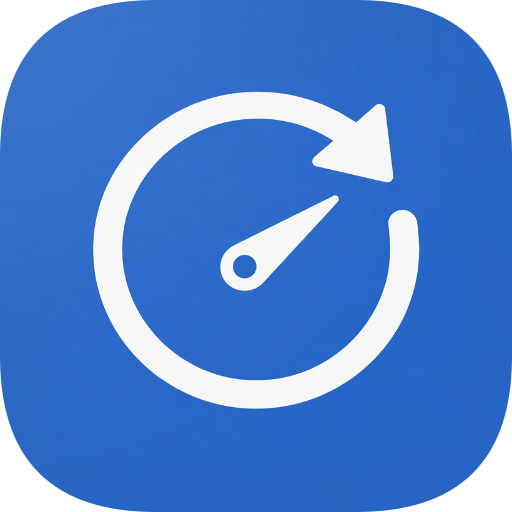
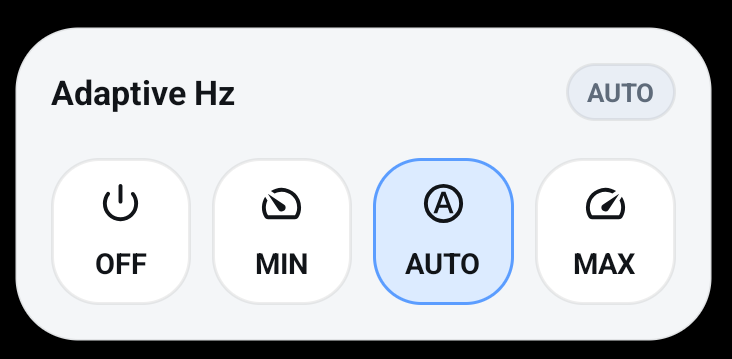
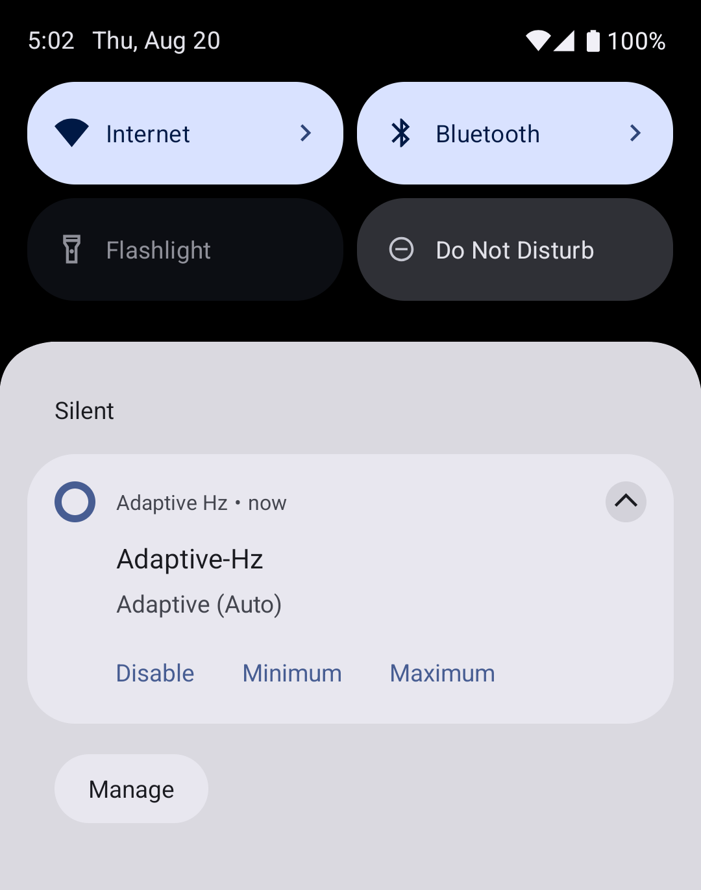
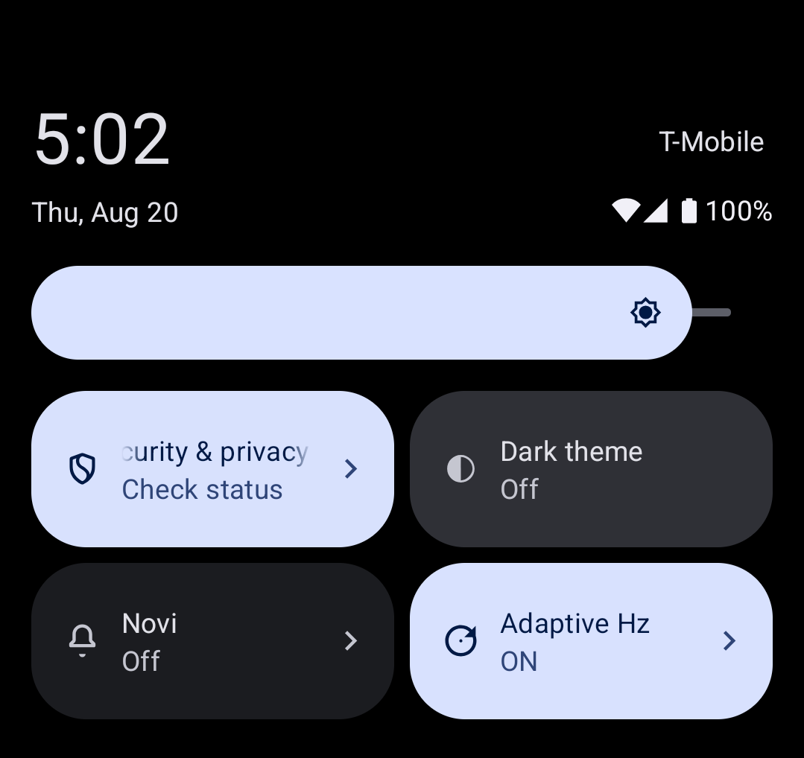
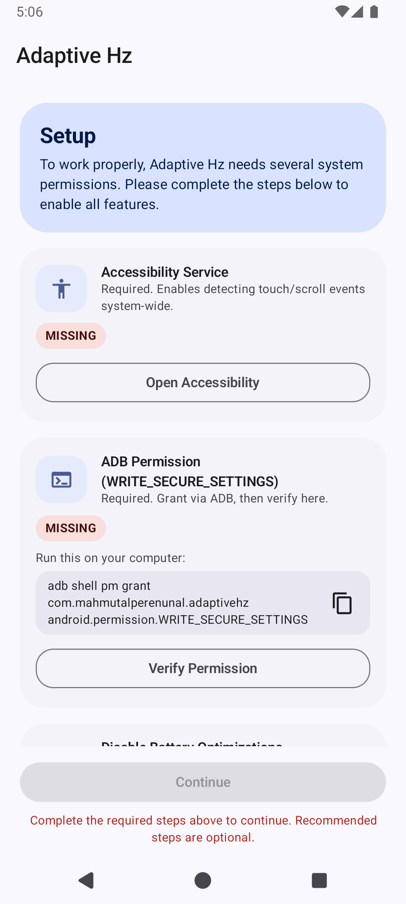
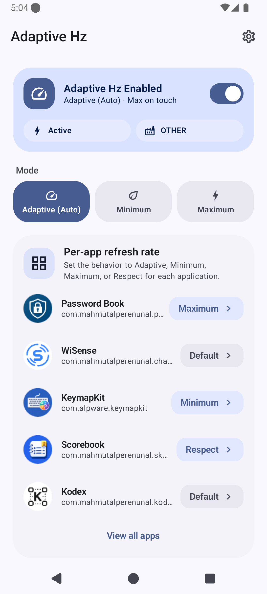
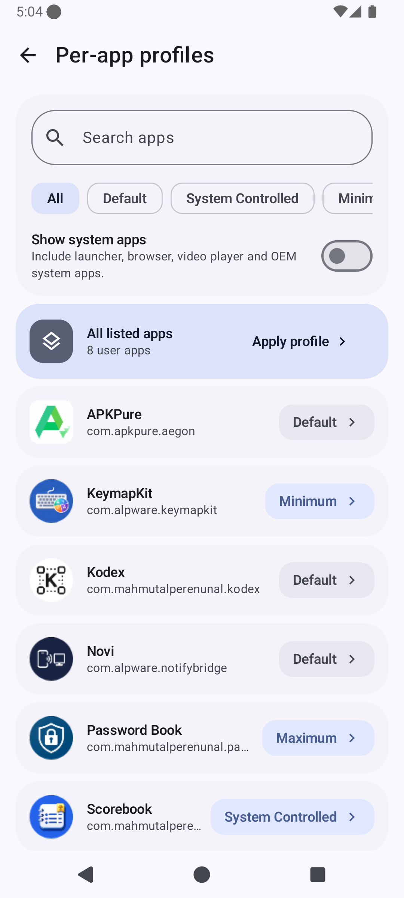
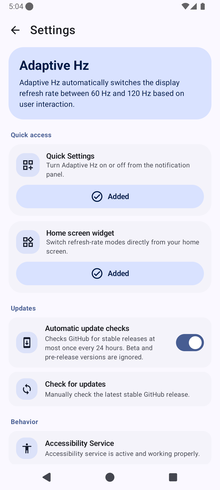
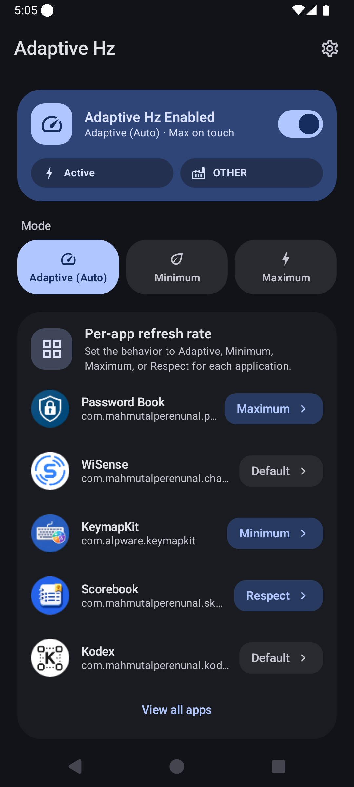

<p align="center">
  
</p>

<p align="center">
  
  
  
  
  
  
</p>

# Adaptive Hz

> Bring true adaptive refresh rate to devices that don’t support it — intelligently, automatically, and without root.

> [!IMPORTANT]
> **Custom refresh-rate support is currently in testing.** Compatible Samsung One UI devices use a device-tested, session-scoped implementation, while HyperOS 3 uses guarded physical-mode verification and is awaiting its first full device acceptance run. Existing vendor modes remain unchanged when custom values are unavailable or rejected.

<p align="center">
  <a href="https://github.com/mahmutaunal/Adaptive-Hz/releases">
    
  </a>
  <a href="#installation">
    
  </a>
</p>

---

⭐ If this project helps you, consider giving it a star!

---

If you'd like to support my work, you can sponsor me on GitHub ❤️

---

## 🚀 What is Adaptive Hz?

> ⚡ Automatically switches between minimum and maximum refresh rates based on real user interaction  
> 🔋 Saves battery without sacrificing smoothness  
> 🔒 100% offline, no tracking, no ads  

Adaptive Hz dynamically switches your device between its supported minimum and maximum refresh rates based on real user interaction.

Unlike OEM implementations, it works globally across apps and focuses on real touch behavior.

---

## ⚡ Quick Start

### 1. Install the APK
Download the latest release and install Adaptive Hz.

### 2. Grant secure settings permission
Run:

```bash
adb shell pm grant com.mahmutalperenunal.adaptivehz android.permission.WRITE_SECURE_SETTINGS
```

### 3. Enable Accessibility Service
Go to:

```text
Settings → Accessibility → Installed Services → Adaptive Hz → Enable
```

### 4. (Optional) Enable Stability Mode
Recommended for devices with aggressive battery optimization.

### 5. (Optional) Enable Advanced Input Detection
For the most accurate adaptive refresh-rate behavior:
- Install Shizuku
- Start Shizuku
- Open Adaptive Hz
- Grant Shizuku permission

> 💡 Adaptive Hz's existing vendor modes work without Shizuku. On supported devices, custom values use Shizuku-owned guarded sessions: session-scoped display tokens on One UI and exact-state-restoring vendor-setting leases on HyperOS 3.

---

## Why Adaptive Hz?

Unlike many refresh-rate utilities, Adaptive Hz is built around real user interaction instead of fixed timers.

The engine:

- Detects actual interaction using Accessibility events
- Optionally verifies real touch input with Shizuku
- Uses vendor-specific refresh-rate strategies
- Automatically adapts to different OEM implementations
- Requires no root
- Runs fully offline

---

## Overview

### Why this exists

Many mid-range Android devices (especially Samsung & Xiaomi) either:
- Do not provide true adaptive refresh rate
- Or limit it to specific apps

This results in unnecessary battery drain or poor responsiveness.

Adaptive Hz was built to fix this gap with a simple, system-wide solution.

---

## Screenshots

A compact look at Adaptive Hz across the app and Android system surfaces.

<table>
  <tr>
    <td align="center" valign="top" width="25%">
      <br />
      <strong>Home Screen Widget</strong><br />
      <sub>Switch refresh-rate modes directly from the launcher.</sub>
    </td>
    <td align="center" valign="top" width="25%">
      <br />
      <strong>Notification Controls</strong><br />
      <sub>Change modes from the persistent notification.</sub>
    </td>
    <td align="center" valign="top" width="25%">
      <br />
      <strong>Quick Settings Tile</strong><br />
      <sub>Turn Adaptive Hz on or off without opening the app.</sub>
    </td>
    <td align="center" valign="top" width="25%">
      <br />
      <strong>Guided Setup</strong><br />
      <sub>Follow clear permission steps with a copyable ADB command.</sub>
    </td>
  </tr>
  <tr>
    <td align="center" valign="top" width="25%">
      <br />
      <strong>Dashboard · Light</strong><br />
      <sub>See the active mode and reach recent app profiles quickly.</sub>
    </td>
    <td align="center" valign="top" width="25%">
      <br />
      <strong>Per-app Profiles</strong><br />
      <sub>Search, filter and configure refresh behavior for each app.</sub>
    </td>
    <td align="center" valign="top" width="25%">
      <br />
      <strong>Settings &amp; Quick Access</strong><br />
      <sub>Manage shortcuts, updates and app preferences in one place.</sub>
    </td>
    <td align="center" valign="top" width="25%">
      <br />
      <strong>Dashboard · Dark</strong><br />
      <sub>Enjoy the complete Material You experience in dark theme.</sub>
    </td>
  </tr>
</table>

Many Android devices offer multiple refresh rates (60Hz / 90Hz / 120Hz) but:

- Do not provide true adaptive switching
- Restrict adaptive behavior to specific apps
- Or aggressively kill background services

Adaptive Hz solves this by:

- Switching to Maximum Hz when you touch or scroll
- Dropping to Minimum Hz when idle
- Operating fully automatically
- Requiring no root access
- Running completely offline (no ads, no tracking)

---

## Key Features

- Interaction-based refresh switching
- Per-app refresh rate profiles
- Configurable drop delay after touch interaction
- Respect app/system refresh behavior option
- Recent apps shortcut powered by optional Usage Access
- Event coalescing to reduce noisy Accessibility event spam
- Vendor-aware refresh control and tuning
- Custom Adaptive, Minimum and Maximum targets on compatible devices
- Independent custom Minimum and Maximum values for per-app profiles on compatible devices
- Optional Shizuku-powered real touch detection for improved accuracy
- Optional Stability Mode (foreground service)
- Diagnostics and Accessibility Event Inspector tools
- Boot persistence
- Minimal, Material You UI

---

## 🌐 Languages

Adaptive Hz currently supports the following languages:

| Language | Locale | Status |
|---|---|---|
| 🇺🇸 English | `en` | ✅ Supported |
| 🇹🇷 Türkçe | `tr` | ✅ Supported |
| 🇪🇸 Español | `es` | ✅ Supported |
| 🇧🇷 Português (Brasil) | `pt-BR` | ✅ Supported |

Want to help with translations?

If you'd like to improve an existing translation or add support for a new language, feel free to open an issue or submit a pull request.

---

## ⚙️ Stability Mode (Optional)

Adaptive Hz includes an optional **Stability Mode** that runs a foreground service with a persistent notification.

### Why it exists
Some Android devices (especially aggressive OEM ROMs) may kill background processes, which can interrupt adaptive refresh behavior.

### What it does
- Keeps the app alive in the background
- Improves reliability of refresh rate switching
- Prevents the system from killing the service

### Trade-offs
- Shows a persistent notification while active
- Can be disabled anytime from Settings

> 💡 If you prefer a clean status bar, you can safely disable it — the app will still work, but background stability may be reduced on some devices.

---

## 🧩 Per-app Refresh Rate Profiles

Adaptive Hz supports per-app refresh rate profiles so users can control how the engine behaves for specific apps.

Available per-app modes:

| Mode | Behavior |
|------|----------|
| Default | Follows the global Adaptive Hz mode |
| Respect app/system | Does not override the app or system refresh behavior |
| Minimum | Keeps that app at the minimum refresh rate |
| Maximum | Keeps that app at the maximum refresh rate |

This is useful for apps that already manage their own refresh behavior, video playback apps, games, browsers, and battery-sensitive apps.

### Recent apps

Adaptive Hz can optionally show recently used apps on the dashboard for faster profile editing.

This requires Android's **Usage Access** permission and is optional. If Usage Access is not granted, per-app profiles still work through the full app list.

### Custom refresh-rate values

Custom values are an optional extension of the existing vendor modes. They are shown only when the display reports more than one physical refresh-rate mode.

- **Adaptive** has one custom target. The normal vendor low state remains unchanged; interaction raises the display to the selected target.
- **Minimum** and **Maximum** each have one independent custom value.
- Per-app custom values are available only for the **Minimum** and **Maximum** profiles. A per-app custom Adaptive profile is intentionally not supported.
- On Samsung/One UI, custom values use the verified DisplayManager min/max token API.
- On HyperOS 3, Adaptive Hz safely probes the two known secure-setting routes and accepts one only after `Display.mode` physically reaches the requested Hz. The verified route is cached per firmware and display identity.
- Root is not used to create a new custom override. This avoids persistent `min_refresh_rate` or `peak_refresh_rate` values surviving force-stop or uninstall.
- If a safe transport, physical verification, or Shizuku is unavailable, Adaptive Hz restores the original state and falls back to the device's existing vendor mode.
- Turning Adaptive Hz off keeps the custom-rate card visible in a passive state so the feature remains understandable without enabling any control.

The selected value is a policy request, not a promise that every frame will be rendered at that rate. The device firmware may temporarily clamp the effective refresh rate because of power saving, thermal state, AOD/lock screen, display resolution, content cadence, or panel policy.

Custom Samsung sessions temporarily open One UI's full physical refresh-rate range before acquiring the requested min/max tokens. The previous Samsung refresh mode is restored when the session ends. HyperOS 3 sessions snapshot the exact original vendor-setting value before the first write and restore it when the session ends. Cleanup runs on Global Off, return to a normal vendor mode, Accessibility-service shutdown, Shizuku service shutdown, normal process teardown, client Binder death, boot, and package replacement. During an update or boot, Adaptive Hz also restores any persistent min/peak snapshot left by versions released before the token-based implementation.

---

## Supported Vendors

### Samsung / One UI
Uses:

```
refresh_rate_mode
```

Compatible One UI builds may additionally use Shizuku-owned, session-scoped DisplayManager min/max tokens for custom values. Physical choices come from `Display.supportedModes`; no model-specific Hz list is hardcoded. If the required Samsung API is unavailable, the app keeps using the existing `refresh_rate_mode` behavior.

### Xiaomi / HyperOS

Adaptive Hz automatically selects the correct refresh-rate implementation depending on the detected HyperOS version.

| HyperOS Version | Setting |
|-----------------|---------|
| HyperOS 1 | `user_refresh_rate` |
| HyperOS 2 | `miui_refresh_rate` |
| HyperOS 3 | `miui_refresh_rate` |

For HyperOS 1, persistent **Maximum** mode uses the vendor-specific value:

```text
user_refresh_rate = 1
```

Adaptive mode continues to use the device's actual supported minimum and maximum refresh-rate values.

HyperOS 3 custom values do not assume that the version's nominal key is effective. The app ranks
`user_refresh_rate` and `miui_refresh_rate` from the live device state, performs a reversible probe,
and caches a route only when the active physical display mode reaches the requested rate. A successful
settings read-back by itself is not considered success. HyperOS 1, HyperOS 2, and the existing normal
Xiaomi modes remain on their previous strategy.

---

## Detection Strategy

To balance responsiveness and stability:

- Immediate boost on real interaction
- Event coalescing to reduce repeated Accessibility event bursts
- Vendor-specific tuning for different OEM event behavior
- Configurable idle fallback delay to return to the minimum refresh rate after touch interaction ends
- Lock screen and Always-On Display ignored
- Per-app override handling before global mode decisions
- Accessibility-based interaction detection fallback
- Optional Shizuku-powered low-level input monitoring
- Real touch verification to ignore passive UI updates (video subtitles, animations, etc.)

This prevents infinite refresh loops and unnecessary maximum-Hz usage.

---

## Permissions

| Permission | Required | Purpose |
|------------|----------|---------|
| WRITE_SECURE_SETTINGS | Yes | Modify refresh rate system setting |
| Accessibility Service | Yes | Detect global interaction |
| Shizuku Permission | Optional (recommended) | Enables low-level real touch detection and owns guarded custom-rate sessions on compatible One UI and HyperOS 3 firmware |
| PACKAGE_USAGE_STATS / Usage Access | Optional | Show recently used apps on the dashboard |
| QUERY_ALL_PACKAGES | Optional | List installed apps for per-app profiles |
| Foreground Service | Optional | Stability Mode |
| Disable Battery Optimization | Recommended | Prevent background kill |
| Notification Permission | Conditional | Required for Stability Mode on Android 13+ |

Grant secure permission via ADB:

```bash
adb shell pm grant com.mahmutalperenunal.adaptivehz android.permission.WRITE_SECURE_SETTINGS
```

---

### 🔓 Optional Root-Assisted Setup

Adaptive Hz does **not require root** and works fully using standard Android permissions.

However, if your device is rooted, you can optionally grant the required permission directly inside the app without using ADB.

#### What it does
- Detects if root access is available on the device
- Attempts to grant `WRITE_SECURE_SETTINGS` automatically
- Falls back to manual ADB setup if the operation fails

#### Notes
- Root support is completely optional
- Behavior may vary depending on ROM and root implementation (Magisk, etc.)
- No background or persistent root access is used — only a one-time permission grant attempt

> 💡 If automatic setup fails, you can always use the manual ADB command above.

---

## ⚡ Advanced Input Detection (Shizuku Optional)

Adaptive Hz includes an optional advanced interaction detection mode powered by Shizuku.

### Why this exists
Some Android apps continuously emit noisy Accessibility events even when the user is not touching the screen.

Common examples:
- YouTube subtitle updates
- Passive animations
- UI auto-refresh events
- Dynamic content updates

This can cause traditional Accessibility-only refresh switching systems to incorrectly keep the display at maximum refresh rate.

### What Adaptive Hz does differently
When Shizuku is enabled, Adaptive Hz can monitor low-level Linux input events directly from the touchscreen device.

This allows the engine to:
- Detect real physical touch input
- Distinguish passive UI updates from actual user interaction
- Prevent false refresh-rate boosts during video playback
- Improve battery efficiency while keeping scrolling smooth

### Behavior
- Shizuku support is optional for the existing vendor modes
- The app still works normally without Shizuku
- Setup marks Shizuku as recommended and never blocks completion when it is unavailable
- Mode and profile screens explain the benefit before continuing, and always allow the user to continue without Shizuku
- Accessibility remains the fallback interaction system
- Input monitoring is used to verify real touch behavior
- The privileged user service owns session-scoped Samsung display tokens and guarded HyperOS 3 setting leases; its generic min/peak write allowlist is retained only to restore legacy snapshots
- No continuous polling loops are used

### Privacy
Adaptive Hz does not collect, store, or transmit touch data.
All processing happens locally on-device.

### Setup
1. Install Shizuku
2. Start Shizuku using wireless debugging or ADB
3. Open Adaptive Hz
4. Grant the Shizuku permission when prompted

> 💡 This mode is intended for advanced users who want the most accurate adaptive refresh-rate behavior possible.

---

## Installation

1. Install APK

```bash
adb install AdaptiveHz.apk
```

2. Grant secure permission (see above)

3. Enable Accessibility Service:

Settings → Accessibility → Installed Services → Adaptive Hz → Enable

4. (Recommended) Enable Stability Mode inside the app

---

## How It Works

| Global Mode | Behavior |
|-------------|----------|
| Adaptive | Automatically switches between minimum and maximum based on interaction |
| Minimum | Locks refresh rate to minimum globally |
| Maximum | Locks refresh rate to maximum globally |
| Off | Restores system default behavior |

Per-app profiles can override the global mode for specific apps. For example, a browser can be set to **Respect app/system**, a game to **Maximum**, and a reader app to **Minimum**.

### Configurable Drop Delay

Adaptive Hz lets users control how quickly the display returns to the minimum refresh rate after touch interaction ends.

This can be adjusted from Settings using the **Drop delay after touch** slider.

Lower values make the device return to minimum Hz more aggressively for better battery savings, while higher values keep maximum Hz active slightly longer for a smoother feel.

The default value is **2 seconds**, matching the app's original adaptive behavior.

### Notification Controls

When **Stability Mode** is enabled, Adaptive Hz provides quick controls directly from the notification:

- **Off state:**
  - Shows a single **On** button

- **Active state:**
  - Shows **Off + 2 dynamic mode buttons** (Adaptive / Min / Max depending on current state)

- **Smart behavior:**
  - Turning off from notification keeps the service alive briefly (grace period)
  - Allows quick re-enable without reopening the app
  - Automatically stops itself after a short time if not used

The system remains fully event-driven and does not run continuous background loops.

---

## ⚡ Quick Settings Tile

Adaptive Hz includes a **Quick Settings Tile** for fast access directly from the system panel.

### What it does
- Toggle Adaptive Hz **On / Off** with a single tap
- Mirrors the app’s default behavior:
  - **On → Adaptive mode**
  - **Off → System default**

### Behavior
- Tile shows current state (**On / Off**) with dynamic subtitle
- Fully synced with in-app state and notification controls
- Long press opens the app for detailed settings

### Design
- Uses a **monochrome icon** optimized for Quick Settings
- Automatically adapts to system light/dark theme
- Built following Android system UI guidelines

> 💡 This provides the fastest way to control Adaptive Hz without opening the app or using notifications.

---

## 🧩 Home Screen Widget

Adaptive Hz includes a **resizable home screen widget** for quick access to refresh rate modes.

### What it does
- Instantly switch between:
  - **Off**
  - **Minimum**
  - **Adaptive**
  - **Maximum**
- Shows the current active mode with a highlighted state and badge
- Provides one-tap control without opening the app

### Behavior
- Fully synced with:
  - In-app state
  - Notification controls
  - Quick Settings tile
- Automatically updates after every action
- Detects setup state:
  - If required permissions are missing, widget enters a **passive state**
  - Tapping the widget opens the app to complete setup

### Layout & Resizing
- Default layout is optimized for **wide (4x1) usage**
- Supports resizing:
  - Expands horizontally for better spacing
  - Switches to a compact layout when space is limited
- Designed to match system widget behavior on **One UI and HyperOS**

### Design
- Minimal, clean card-style layout
- Supports light/dark system themes
- Uses subtle visual states:
  - Active mode highlight
  - Disabled state when setup is incomplete

> 💡 The widget is the fastest way to control Adaptive Hz modes directly from your home screen.

---

## Architecture

```text
Adaptive-Hz/
├── .github/
│   ├── ISSUE_TEMPLATE/                # Bug, feature and device-support forms
│   └── FUNDING.yml
├── app/
│   ├── src/main/
│   │   ├── AndroidManifest.xml
│   │   ├── aidl/.../core/shizuku/
│   │   │   ├── IInputEventCallback.aidl
│   │   │   └── IInputMonitorService.aidl
│   │   ├── assets/
│   │   ├── java/.../adaptivehz/
│   │   │   ├── MainActivity.kt
│   │   │   ├── core/
│   │   │   │   ├── apps/
│   │   │   │   │   ├── InstalledAppInfo.kt
│   │   │   │   │   ├── InstalledAppsRepository.kt
│   │   │   │   │   └── RecentAppsProvider.kt
│   │   │   │   ├── debug/
│   │   │   │   │   ├── DebugAccessibilityEvent.kt
│   │   │   │   │   └── DebugEventStore.kt
│   │   │   │   ├── engine/
│   │   │   │   │   ├── model/
│   │   │   │   │   │   ├── DeviceVendor.kt
│   │   │   │   │   │   ├── EngineModels.kt
│   │   │   │   │   │   ├── VendorStrategy.kt
│   │   │   │   │   │   └── VendorTuning.kt
│   │   │   │   │   ├── strategy/
│   │   │   │   │   │   ├── OtherStrategy.kt
│   │   │   │   │   │   ├── SamsungStrategy.kt
│   │   │   │   │   │   ├── VendorStrategyProvider.kt
│   │   │   │   │   │   └── XiaomiStrategy.kt
│   │   │   │   │   ├── AdaptiveHzEngine.kt
│   │   │   │   │   └── AdaptiveHzRuntimeState.kt
│   │   │   │   ├── health/AccessibilityHealthMonitor.kt
│   │   │   │   ├── input/InteractionSignalProvider.kt
│   │   │   │   ├── locale/AppLocaleController.kt
│   │   │   │   ├── prefs/AdaptiveHzPrefs.kt
│   │   │   │   ├── quickaccess/QuickAccessManager.kt
│   │   │   │   ├── service/
│   │   │   │   │   ├── AdaptiveHzActionHandler.kt
│   │   │   │   │   ├── AdaptiveHzService.kt
│   │   │   │   │   ├── AdaptiveHzTileService.kt
│   │   │   │   │   └── StabilityForegroundService.kt
│   │   │   │   ├── shizuku/
│   │   │   │   │   ├── InputMonitorUserService.kt
│   │   │   │   │   └── ShizukuInputManager.kt
│   │   │   │   ├── support/SupportPromptPolicy.kt
│   │   │   │   ├── system/
│   │   │   │   │   ├── BootReceiver.kt
│   │   │   │   │   ├── RefreshRateController.kt
│   │   │   │   │   └── RootManager.kt
│   │   │   │   └── update/GitHubUpdateChecker.kt
│   │   │   ├── ui/
│   │   │   │   ├── components/UpdateUi.kt
│   │   │   │   ├── home/
│   │   │   │   │   ├── components/
│   │   │   │   │   │   ├── DashboardContent.kt
│   │   │   │   │   │   └── SetupContent.kt
│   │   │   │   │   ├── HomeScreen.kt
│   │   │   │   │   └── PerAppRefreshScreen.kt
│   │   │   │   ├── settings/
│   │   │   │   │   ├── components/SettingsComponents.kt
│   │   │   │   │   ├── AccessibilityEventInspectorScreen.kt
│   │   │   │   │   ├── DiagnosticsScreen.kt
│   │   │   │   │   └── SettingsScreen.kt
│   │   │   │   └── theme/
│   │   │   │       ├── Color.kt
│   │   │   │       ├── Shape.kt
│   │   │   │       ├── Theme.kt
│   │   │   │       └── Type.kt
│   │   │   └── widget/
│   │   │       ├── AdaptiveHzWidgetProvider.kt
│   │   │       └── AdaptiveHzWidgetUpdater.kt
│   │   └── res/                         # Strings, themes, widget layouts and icons
│   ├── src/test/.../adaptivehz/
│   │   ├── ExampleUnitTest.kt
│   │   └── core/
│   │       ├── support/SupportPromptPolicyTest.kt
│   │       └── update/SemanticVersionTest.kt
│   └── build.gradle.kts
├── assets/                              # README logo and screenshots
├── gradle/libs.versions.toml
├── build.gradle.kts
├── settings.gradle.kts
└── README.md
```

---

## Performance

- Very low CPU usage
- No polling loops
- Battery savings typically 5–15% per day (usage dependent)

---

## 🔬 Technical Highlights

- Event-driven architecture (no polling)
- Minimal CPU overhead
- OEM and ROM version-aware refresh-rate control
- Accessibility-based interaction detection
- Optional Shizuku-based low-level input monitoring
- Real touch validation against noisy Accessibility events
- Per-app profile decision layer
- Event coalescing for noisy Accessibility event streams
- Diagnostics screen for runtime state inspection
- Accessibility Event Inspector for device-specific debugging

---

## 📊 Benchmark & Testing

Typical battery savings: **~5–15% per day** (usage dependent)

Test methodology:
- Device: Samsung Galaxy A52 (120Hz)
- Scenario: Mixed usage (scrolling + idle periods)
- Comparison: Fixed 120Hz vs Adaptive Hz enabled
- Measurement: Battery usage over a full day

Note: Results may vary depending on usage patterns and device behavior.

---

## Known Limitations

- Depends on OEM allowing secure setting writes
- Some ROMs may override refresh policies
- HyperOS behavior may differ between major versions and regional ROMs.
- User force-stop disables background switching until reopened
- Accessibility service must remain enabled
- Recent apps shortcuts require optional Usage Access permission
- Custom fixed values require a compatible verified transport and a live Shizuku connection
- HyperOS 3 custom values are in testing and remain experimental until the first full physical-device acceptance run
- A reported display mode can still be clamped by OEM power, thermal, AOD, resolution, or content policies

---

## Tested Devices

- Samsung Galaxy A52 (Android 14 / One UI 6)
- Samsung Galaxy S24 (One UI — custom values device-tested)
- Redmi Note 14 Pro 5G (HyperOS 3.x – Community-tested)
- Poco F3 (HyperOS 1.x – Community-tested)

More devices welcome.

---

## 📱 Compatibility

Adaptive Hz uses vendor- and ROM-aware refresh-rate handling. Compatibility can vary depending on the device model, Android version, regional ROM, and OEM display policy.

| Brand / Platform | Device / ROM | Refresh-rate setting | Status | Notes |
|---|---|---|---|---|
| Samsung One UI | Galaxy A52 / One UI 6 | `refresh_rate_mode` | ✅ Stable | Existing Samsung behavior remains unchanged. |
| Samsung One UI | Other supported Galaxy devices | `refresh_rate_mode` | ✅ Existing behavior retained | Normal Adaptive, Minimum, Maximum and Off modes continue to use the established vendor path. |
| Samsung One UI | Galaxy S24 | Session-scoped DisplayManager tokens for custom values | ✅ Device-tested | Global and per-app custom values have been verified on-device; broader One UI reports are requested. |
| Samsung One UI | Other compatible Galaxy devices | Session-scoped DisplayManager tokens for custom values | 🧪 Testing | Requires the verified Samsung token API and a live Shizuku connection; available values come from the physical display modes. |
| Xiaomi / HyperOS 1 | Poco F3 / HyperOS 1 | `user_refresh_rate` | ✅ Community tested | Adaptive mode uses the physical minimum and maximum Hz values. Persistent Maximum mode uses `user_refresh_rate = 1`. |
| Xiaomi / HyperOS 2 | HyperOS 2 devices | `miui_refresh_rate` | ⚠️ Experimental | Some HyperOS 2 builds may override refresh-rate values or apply separate launcher and System UI policies. More device reports are needed. |
| Xiaomi / HyperOS 3 | Redmi Note 14 Pro 5G / HyperOS 3 | Runtime-verified `user_refresh_rate` / `miui_refresh_rate` route | 🧪 Custom validation pending | Normal modes remain unchanged. Custom values use physical modes reported by the display, reversible route probing, exact-state restoration, and fail-safe legacy fallback. |
| Xiaomi / MIUI or unknown HyperOS builds | Xiaomi, Redmi, and Poco devices | `miui_refresh_rate` fallback | ⚠️ Best effort | Regional and custom ROM variants may behave differently. |
| Other Android vendors | Pixel, OnePlus, Nothing, and others | Vendor-specific / unsupported | 🧪 Planned | Additional vendor support is planned and community testing is welcome. |

---

## ❓ FAQ

### Is this safe for my device?
Adaptive Hz does not modify display hardware or firmware. It uses Android/OEM refresh-rate controls and restores temporary custom state when the feature is disabled. Custom refresh-rate support is currently in testing because OEM behavior can vary between device models, firmware versions, and regions; device reports are encouraged.

### Does it require root?
No. It works using standard Android permissions.

### Does it collect any data?
No. The app is completely offline and does not track users.

### Will it drain battery?
No — it is designed to reduce battery usage by lowering refresh rate when idle.

---

## 💬 Community

Join the discussion and connect with other users:

- Ask questions in Q&A
- Share device compatibility results
- Suggest new features and improvements
- Discuss ROM-specific behavior

👉 Visit Discussions: https://github.com/mahmutaunal/Adaptive-Hz/discussions

---

## 🤝 Contributing

Contributions, feedback, and device reports are welcome.

You can help by:

- Reporting bugs via Issues
- Sharing device compatibility results in Discussions
- Suggesting features in Ideas
- Improving code via Pull Requests

Please include when relevant:

- Device model
- Android version
- ROM / UI
- Supported refresh rates
- Diagnostics report if available
- Accessibility Event Inspector output for event-related issues

---

## License

MIT License

---

## 🗺️ Roadmap

- [x] Per-app refresh rate profiles
- [x] Diagnostics screen
- [x] Accessibility Event Inspector
- [x] Event coalescing
- [x] Configurable drop delay after touch interaction
- [ ] Custom refresh-rate values
- [ ] More vendor support (Pixel, OnePlus)

Made with care by AlpWare Studio

---

## 🤝 Acknowledgements

Inspired by limitations in OEM adaptive refresh rate implementations.

---
